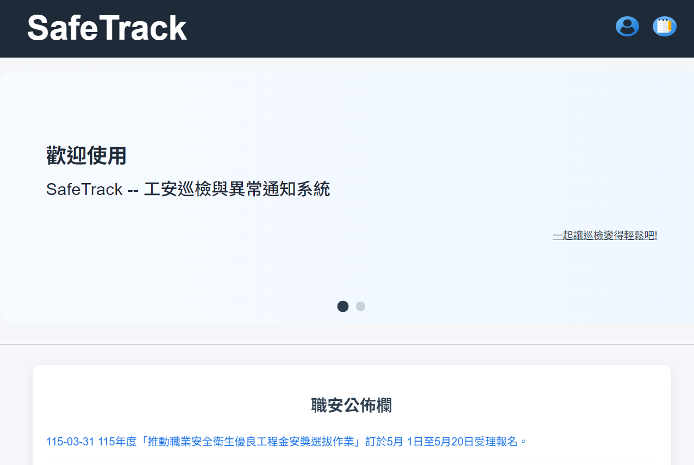
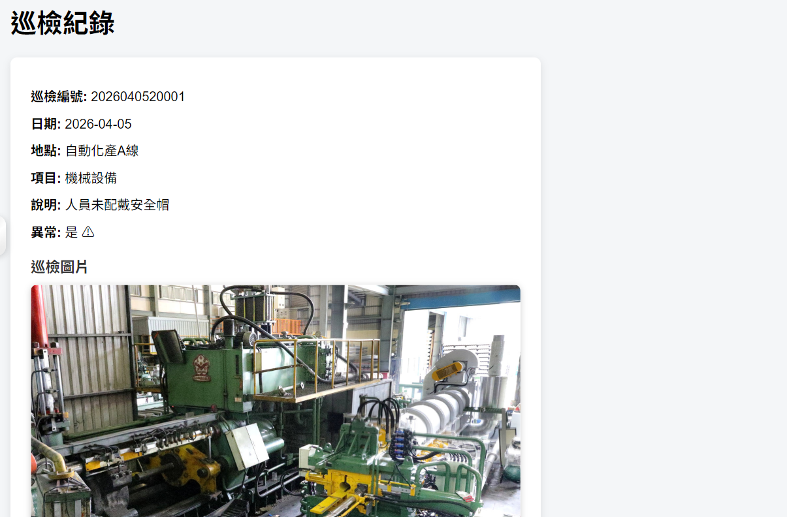
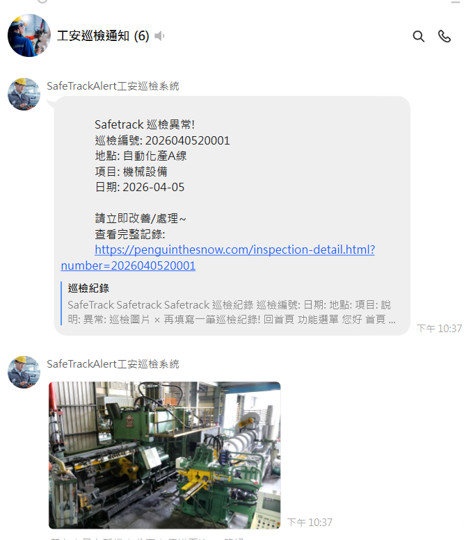
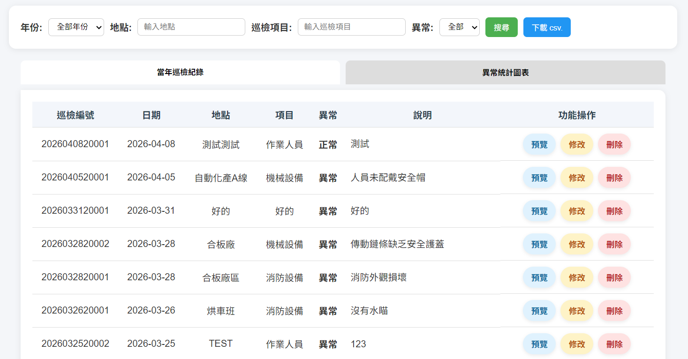
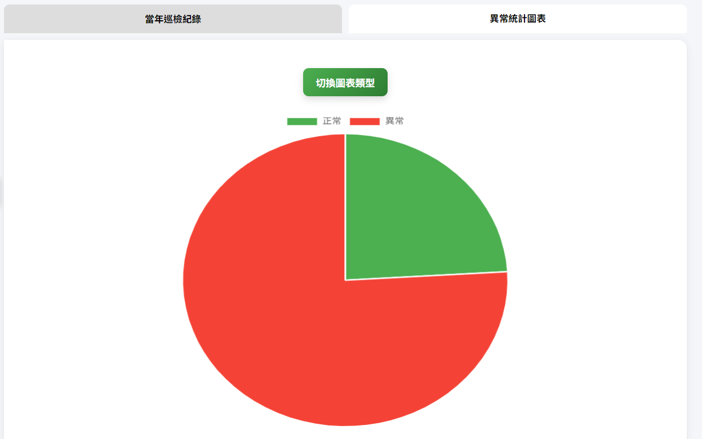
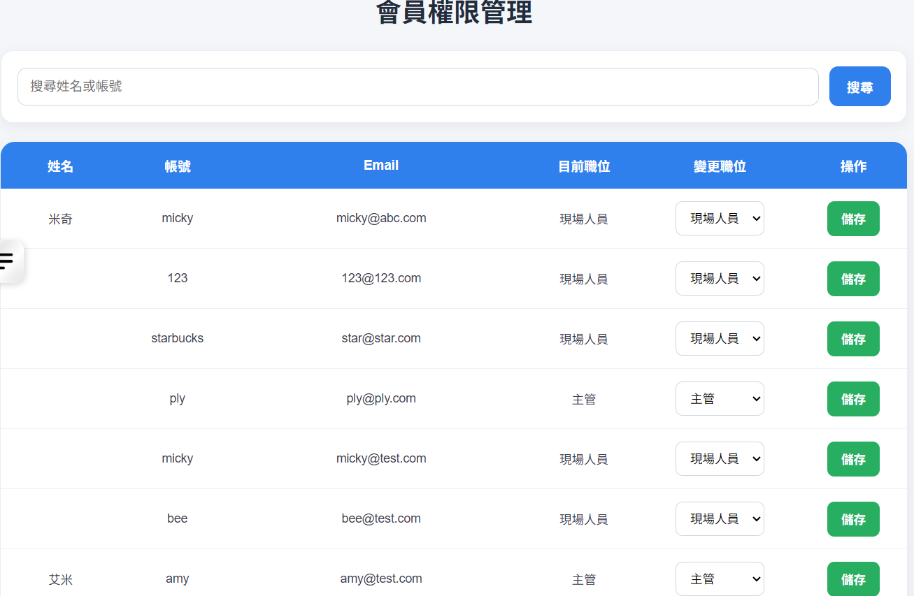

# 🚀 Safetrack - 工安巡檢與異常通知系統
### 一套提供主管與現場人員使用的巡檢管理系統，支援即時異常回報、LINE 通知、歷史查詢與統計分析。

## 📌 專案簡介
Safetrack 是一套專為工地 / 工廠安全管理設計的巡檢系統，解決傳統紙本巡檢「難統整、延遲通知」的問題。

透過系統化流程：

  📱 線上填報巡檢
  
  🚨 異常即時 LINE 通知
  
  📊 歷史數據分析
  
  👥 主管權限管理
  
大幅提升安全管理效率。

## 🎯 核心功能
**1️⃣ 巡檢紀錄填報** 
- 建立巡檢資料（日期 / 地點 / 項目）
- 支援多張圖片上傳（AWS S3）
- 自動生成巡檢編號
- 可標記異常狀態

**📸 功能畫面：**

**2️⃣ LINE 即時異常通知**
- 異常自動推送 LINE 群組
- 顯示：
  - 巡檢編號
  - 地點
  - 項目
  - 日期
  - 支援圖片通知

**📸 LINE 通知畫面：**

**3️⃣ 歷史紀錄查詢**
  - 年份篩選
  - 地點 / 項目搜尋
  - 異常篩選
  - 支援 CSV 匯出

**📸 歷史紀錄畫面：**

**4️⃣ 統計分析圖表**
  - 異常數量統計
  - 年度資料分析
  - 視覺化圖表呈現

**📸 統計圖表：**

**5️⃣ 權限管理系統**
  - 主管 / 現場人員角色區分
  - 主管可：
    - 管理通知設定
    - 修改使用者權限

**📸 權限管理畫面：**

  
